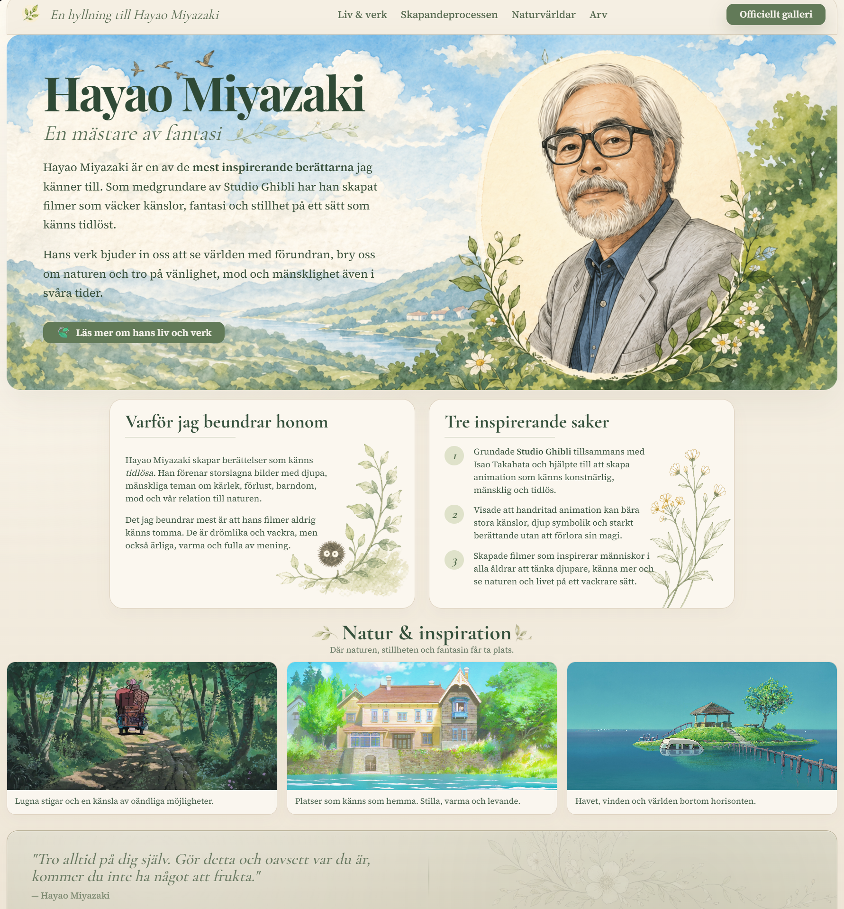

# Hayao Miyazaki Hyllningssida

En handgjord hyllningssida inspirerad av Hayao Miyazakis berättarvärld, naturkänsla och tidlösa visuella språk.

## Om projektet

Det här projektet är en visuell HTML/CSS-övning där målet var att skapa en lugn, poetisk och sammanhållen hyllningssida.

Fokus låg på att bygga en tydlig helhetskänsla genom typografi, färgpalett, bildkomposition, mjuka illustrationer och små handritade detaljer.

## Tekniker

- HTML
- CSS
- Responsiv layout

## Fokusområden

- Typografi
- Layout och bildkomposition
- Färgpalett
- Visuell hierarki
- Handritade SVG-detaljer
- Stämningsfull och sammanhållen design

## Innehåll

Sidan innehåller externa länkar till material om Hayao Miyazaki, hans skapandeprocess, naturvärldar och Studio Ghiblis officiella bildgalleri.

## Live demo

Kommer snart.

## Notis

Det här är ett icke-kommersiellt hyllningsprojekt skapat för lärande och portfolio.  
Alla rättigheter till Hayao Miyazaki / Studio Ghibli-relaterat material tillhör respektive rättighetsägare.

---

# Hayao Miyazaki Tribute Page

A handcrafted tribute page inspired by Hayao Miyazaki’s storytelling, sense of nature and timeless visual language.

## About the project

This project is a visual HTML/CSS exercise with the goal of creating a calm, poetic and cohesive tribute page.

The focus was on building a clear overall atmosphere through typography, color palette, image composition, soft illustrations and small hand-drawn details.

## Technologies

- HTML
- CSS
- Responsive layout

## Focus areas

- Typography
- Layout and image composition
- Color palette
- Visual hierarchy
- Hand-drawn SVG details
- Atmospheric and cohesive design

## Content

The page includes external links to material about Hayao Miyazaki, his creative process, nature worlds and Studio Ghibli’s official image gallery.

## Live demo

Coming soon.

## Note

This is a non-commercial tribute project created for learning and portfolio purposes.  
All rights to Hayao Miyazaki / Studio Ghibli related material belong to their respective owners.